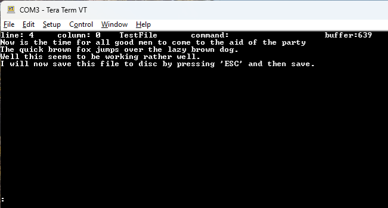

# Small C Plus Compiler for the TMS9900/TMS99000 - Version 1.06a
I have implemented new version of the Small C plus by  Cain, Van Zandt, Hendrix, Yorston version that emits code that will run on a TMS9900/TMS99000 
Single Board Computer with at least 64k Bytes of memory.   This new version of Small-C is a major improvement on small C version 2.1 and includes unsigned integers, chars, floating point support, as well as structures and unions and other standard C language support that is absent from Small C version 2.1.  Indeed it compiles and runs the VT100 (https://ttssh2.osdn.jp/index.html.en) screen editor ED2 https://github.com/mdlougheed/ed2  without difficulty.  A screen capture is shown here:

<div style="text-align:center;">
    
</div>

# Floating Point Library
The floating point libraray implementation is a retargetting of  Anders Hejlsberg's Z80 Floating Point library (FloatM48.z80)

The code produced can be either compiled to produce standalone code (using the -M) flag and assembled using the A99 assembler to run at an absolute location in memory.  If it needs to be linked to other runtime libraries then it will produce relocatable assembly code that can be assembled and linked with other modules using the R99 (Relocatable assembler) assembler in conjuction with the linker loader (Link99).  The relocatable applications use the standard REL format.

It is compiled using MingW GCC and therefore operates as a Cross Compiler however the C code is standard C and 
should be able to self compile with the appropriate OS support on the target computer.  The Eclipse project files are included as a zip file that
may help building and testing the compiler in your own environment.

An IOLIB is included that supports CP/M compatible (BDOS in this respository) operating system calls and a core set of 40bit floating point library routines.  The core set includes, FPADD, FPMUL,FPSUB, FPDIV, SIN, COS, TAN, POW,LN,EXP, SQRT.   Other functions such as trancedentals will be added later.  The TMS9900 Floating Point Library filename is CFLOAT48.A99 and was ported from a Z80 Floating Point library.

A test programme for the Byte Sieve.c benchmark is included and runs on a 20MHz TMS99105A in 18 seconds.

A sample test programme that demonstrates how to calculate a Double Integral using Simpson's Rule is shown below and is compiled using the following syntax:

```
	copy DoubleIntegralSimpsonsRule.c, cDSR99.c
	smallcp -C cDSR99
	R99 cDSR99 SCHCLC
	link99  -M  -S cDSR99 clib99.LIB iolib99.LIB strlib99.LIB fplib99.LIB
```

The programme performs a double integration on the following mathemtical function"

```
	zd = cos(pi * cos(x) / 2.0) * cos(pi * (1.0 - sin(x) * cos(y)) / 4.0);
	zd = pow(zd, 2.0)/sin(x);
```

This is a very good test of the Floating Point library.

```
/*
 ============================================================================
 Name        : DoubleIntegralSimpsonsRule.c
 Author      : Alex Cameron
 Version     :
 Copyright   : None
 Description : Simpson integration technique for
 	 	 	   evaluating  double integrals
 ============================================================================
 */

#include "float.h"
double fxy[100], fy[12];
double pi;
double f();

main() {

	double llx, lly, ulx, uly, x, y;
	double hx, hy, ef, of, simpson;
	int nosx, nosy, i, j;

	/*
	 *
	============================================================================
	 *
	 *	Simpson integration constants.
	 *		nos -> number of strips
	 *		ul  -> upper limit of integration
	 *		ll  -> lower limit of integration
	 *		h   -> incremental value per strip
	 =============================================================================
	 */
	pi = 3.1415926;
	nosx = 10;
	nosy = 8;

	llx = 0.1e-8;
	lly = 0.1e-8;

	ulx = pi;
	uly = 2.0 * pi;

	hx = (ulx - llx) / nosx;
	hy = (uly - lly) / nosy;

	printf("\n\nDouble integration parameters: \n");
	printf(" Step size hx and hy:  %10.6f,%10.6f\n", hx, hy);
	printf(" Number of steps (x,y): %d,%d\n\n", nosx, nosy);

	/*
	 Calculate all the points within the integration domain
	 */

	for (j = 0; j <= nosy; j++) {
		y = j * hy + lly;
		for (i = 0; i <= nosx; i++) {
			x = i * hx + llx;
			fxy[i+j*nosx] = f(x, y);
		}
	}
	/*
	 ========================================================
	 Now perform a Simpson integration along
	 the x axis and accumulate results using
	 the y axis variable as an index
	 ===========================================================
	 */

	for (j = 0; j <= nosy; j++) {
		of = fxy[1 + j*nosx];
		ef = 0.0;
		for (i = 2; i <= nosx - 2; i += 2) {
			ef += fxy[i + j*nosx];
			of += fxy[i + 1 + j*nosx];
		}
		fy[j] = fxy[0 + j*nosy] + fxy[nosx + j*nosx] + 2.0 * ef + 4.0 * of;

	}

	/*
	 * ========================================================
	 * Lastly perform Simpson integration
	 *  along the y axis.
	 * ========================================================
	 */
	of = fy[1];
	ef = 0.0;
	for (j = 2; j <= nosy - 2; j += 2) {
		ef += fy[j];
		of += fy[j + 1];
	}
	simpson = (hx * hy / 9.0) * (fy[0] + fy[nosy] + 2.0 * ef + 4.0 * of);
	printf("Result = %10.6f\n\n", simpson);
}

/*
 * ==============================================================
 * Enter the function to be integrated here.
 * plot  abs(((cos(pi*cos(x)/2.0)*cos(pi*(1.0-sin(x)*cos(y))/4.0))^2)/sin(x))
 * ===============================================================
 */
double f(x, y)
double x, y; {
double zd;

	zd = cos(pi * cos(x) / 2.0) * cos(pi * (1.0 - sin(x) * cos(y)) / 4.0);
	zd = pow(zd, 2.0)/sin(x);
	return (fabs(zd));
}


```
```
A output of running the above is shown below.

%cDSR99

Double integration parameters: 
 Step size hx and hy:    0.314159,  0.785398
 Number of steps (x,y): 10,8

Result =   3.827845
%
```
